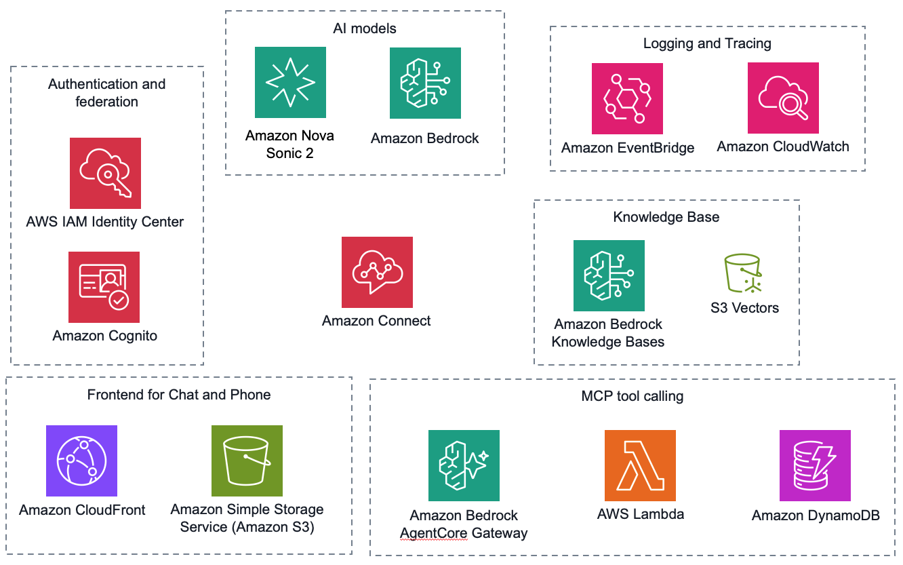

# Deployment Speed Dial for Amazon Connect

A deployment accelerator that scaffolds and deploys a working Amazon Connect Customer Contact Center.
This skill was developed to accelerate Amazon Connect deployments and ships with helpful blueprints.

> [!NOTE]  
> This project is a reference implementation intended as a starting point. Although it is built to AWS best practices, you should perform your own security review and hardening before any production deployment.



## Features

What the deployed contact center supports today:

| Feature | Status | Notes |
|---------|:------:|-------|
| **Nova Sonic 2 voice agent** | ✅ | Q-in-Connect orchestration agent (Claude Haiku 4.5) + self-service answer generation (Nova Pro). |
| **Knowledge base (RAG)** | ✅ | Optional — Bedrock Managed Knowledge Base (S3 Vectors) wired to the Q-in-Connect `Retrieve` tool; populated at setup from the bundled sample data or your own folder via `scripts/sync-kb.sh` (re-runnable anytime). |
| **Human transfer** | ✅ | Always on — routes the agent's Escalate outcome to a live-agent queue. |
| **Tool calling (MCP)** | ✅ | Always on — ships a sample Lambda tool and wires the AgentCore MCP gateway's tools into the agent. |
| **Call recording (consent gate)** | 📦 | Ships as a ready-made flow module (`consent-analytics-setup`) — a DTMF/view consent gate that records the call (Agent + Customer) and enables Contact Lens analytics on consent. It is deployed but **not wired into the default flow**; add an `InvokeFlowModule` step to the base flow to enable it (see [Capabilities](#capabilities)). |
| **Storage encryption** | ✅ | Always on — a customer-managed KMS key (annual rotation) encrypts the storage bucket, Connect storage configs, and the Customer Profiles domain. |
| **Customer Profiles** | ✅ | Optional (on by default) — uses Amazon Connect Customer Profiles to personalize the caller experience. Identity is mapped by phone number, or by Cognito sub / email when using the web widget. |
| **Pre-call context injection** | ✅ | Always on with Customer Profiles — a Lambda pushes the caller's identity and most recent order into the Q Connect session before the agent starts, so it knows the caller from the first turn. |
| **Analytics data lake** | ✅ | Optional — enables the Connect analytics data lake (contact records, flow events, agent stats). |
| **Web-call frontend** | ✅ | Optional — browser-based calling (CloudFront + Cognito + API Gateway), with guided widget + sign-in setup. |
| **UK phone number (DID)** | ✅ | Auto-claims a `+44` number and attaches it to the flow; other countries via the console. |
| **Contact-events logging** | ✅ | Optional — EventBridge rule + Lambda logging contact lifecycle (DISCONNECTED) events to CloudWatch. |
| **Language selection** | ✅ | English (`en_US`) or German (`de_DE`) — localizes the greeting, agent and self-service prompts, goodbye/error messages, the recording-consent prompt, the Lex bot locale, and the TTS voice/language. Any region × language combination is valid. |
| **Region selection** | ✅ | `us-east-1` (N. Virginia, default) or `eu-central-1` (Frankfurt). Both run the full Connect + Q-in-Connect + Lex + Nova Sonic voice stack; the Bedrock inference-profile prefix (`us.*` / `eu.*`) is derived from the region. |
| **Voice selection** | ✅ | Feminine (default) or masculine **Amazon Connect agentic voice**, resolved per language (English → KATIE/RONALD, German → VIKTORIA/SEBASTIAN). The flow's Set-voice block selects the provider via `TextToSpeechEngine: connect:agentic`; Polly voice names are not valid for it. |

Planned / not yet available:

| Feature | Status | Notes |
|---------|:------:|-------|
| Connect Agent Panel | 🚧 | Agent workspace UI for live agents. |
| Observability dashboard | 🚧 | Beyond the basic contact-events logging that ships today. |

> **Region:** deploys to **`us-east-1`** (N. Virginia, default) or **`eu-central-1`** (Frankfurt),
> chosen at setup. Both support the full Nova Sonic voice stack.

## Usage

The blueprints in this repository can be deployed either by a simple Python script or through the help of an agentic coding assistant.
The second option is easier for beginners because it gives you more direction through a conversational interface.

### Coding assistant supported deployment

Trigger the skill in Claude Code or Kiro by saying:

- "Set up Amazon Connect"
- "Deploy a Nova Sonic agent"
- "Create a Connect instance"
- "Connect AI agent blueprint"

The skill walks you through six phases interactively:

1. **Gather inputs** — project name, company name, greeting, region (US / Frankfurt), language & voice (English/German, feminine/masculine), optional capabilities (Customer Profiles / analytics data lake / contact-events logging / knowledge base), and how you'll reach it (UK DID / web-call / manual)
2. **Preflight** — validates AWS credentials, CDK bootstrap, Bedrock model access
3. **Render templates** — generates a CDK project from templates with your config
4. **Deploy** — runs `cdk deploy --all` to create AWS resources (~20 minutes)
5. **Claim UK DID** _(optional)_ — searches and associates a UK phone number; skip this if you want to claim a different country or pick a specific number yourself in the console
6. **Smoke test** — verifies all resources are healthy

### Deterministic deployment (no coding assistant)

Prefer a plain script over an AI assistant? `scripts/deploy.py` (Python 3, stdlib-only) runs
the identical flow deterministically: it interviews you (same questions, same defaults as the
skill), writes the same order file, and drives the same scripts — so deployments are
reproducible from either front door, and you can switch between them freely.

**Quickstart — deploy an AI contact center (copy-paste):**

Prerequisites (one-time): AWS credentials with admin access configured in your shell,
Node.js 18+, Python 3.9+, and [Bedrock model access](#prerequisites) enabled in the target
region. The script handles CDK bootstrap itself.

```bash
git clone https://github.com/aws-samples/sample-amazon-connect-speed-dial.git
cd sample-amazon-connect-speed-dial
scripts/deploy.py
```

Answer the interview questions (or press Enter to accept the defaults) — about 20 minutes
later you have a working AI contact center, verified by an automatic smoke test, plus a
personalized checklist for anything that needs the console. For a zero-question deployment
with all defaults (us-east-1, English, feminine voice, no add-ons):

```bash
scripts/deploy.py --express -p my-contact-center
```

Tip: answer the "How will you reach the agent?" question with **(a) UK phone number** for a
dialable number claimed automatically, or **(b) web-call frontend** for browser-based calling
(finished with one console step from the printed checklist). Express mode claims a UK
number automatically — the same default the skill's express path uses.

All modes:

```bash
scripts/deploy.py                                  # interactive interview
scripts/deploy.py --express -p myproject           # all defaults
scripts/deploy.py --order-file .connect-skill-order.myproject.json   # non-interactive / CI
scripts/deploy.py --order-file ... --synth-only    # render + synth only, no AWS resources
```

Console-dependent steps (web-call widget, Identity Center app config) can't be scripted; the
CLI finishes with a personalized checklist telling you exactly which file to create and which
helper script to run for each.

## What it deploys

Seven CloudFormation stacks in the selected region (`us-east-1` or `eu-central-1`); plus
**WebcallWidget** when the web-call frontend is enabled, and **ContactEvents** when
contact-events logging is enabled:

| Stack | Resources |
|-------|-----------|
| ConnectInstance | Connect instance, Customer Profiles, storage bucket |
| Queues | Default queue and 24x7 hours of operation |
| Wisdom | Q-in-Connect assistant, knowledge base (+ optional Bedrock KB with S3 Vectors), AI prompts (orchestration + answer gen), AI agents (orchestration + self-service), Lex V2 bot + alias, Connect integrations |
| ContactFlow | Inbound contact flow with AI Agent compound block (CreateWisdomSession → UpdateContactData → ConnectParticipantWithLexBot), composed from the base flow + capability branches |
| AgentCoreGateway | Bedrock AgentCore MCP gateway + sample Lambda tool, registered as an MCP server integration on the instance |
| FlowLambdas | Lambda functions for contact-flow tool calls |
| ContactEvents _(conditional)_ | EventBridge logging for contact events (`contactEventsEnabled`) |
| PostDeploy | Custom resources to set default AI agents on the assistant |
| WebcallWidget _(conditional)_ | CloudFront + Cognito + API Gateway for browser-based web calling |

## Capabilities

**Always on** — built into the default contact flow and stacks, with no flags to set:

- **Human transfer** — the agent's Escalate outcome is routed to a live-agent queue.
- **Tool calling (MCP)** — a sample Lambda tool plus the AgentCore gateway's MCP tools are wired into the AI agent.
- **Storage encryption** — a customer-managed KMS key (annual rotation) encrypts the storage bucket, the Connect storage configs, and the Customer Profiles domain.

**Ships as a module (not wired into the default flow):**

- **Call recording + Contact Lens analytics** — the deploy always creates a `consent-analytics-setup` contact-flow module: a consent gate (DTMF on voice, a view on chat) that, on consent, records the call (Agent + Customer) and turns on Contact Lens analytics. The default flow does **not** invoke it, so recording is off out of the box. To enable it, add an `InvokeFlowModule` step referencing the `<project>-consent-analytics-setup` module near the start of the base flow (before the AI Agent block) in the Connect flow designer, then save & publish. The module's consent prompts are localized to the deployment language.

**Optional** — set from your order file (defaults in parentheses); the interview / `deploy.py` asks about each one:

| Order key | Default | What it does |
|-----------|:-------:|--------------|
| `customerProfilesEnabled` | `true` | Deploys the Customer Profiles domain, looks the caller up in the flow, and pre-injects their identity + most recent order into the Q Connect session. |
| `knowledgeBaseEnabled` | `false` | Provisions a Bedrock Managed Knowledge Base (S3 Vectors) wired to the Q-in-Connect `Retrieve` tool; populate it at setup (sample data or your own folder) or later via `scripts/sync-kb.sh`. |
| `dataLakeEnabled` | `false` | Enables the Connect analytics data lake (contact records, flow events, agent stats). |
| `contactEventsEnabled` | `false` | Adds an EventBridge rule + Lambda that log contact lifecycle (DISCONNECTED) events to CloudWatch. |
| `frontendEnabled` | `false` | Deploys the browser-based web-call site (CloudFront + Cognito + API Gateway). |
| `identityCenterEnabled` | `false` | Authenticates agents/admins via IAM Identity Center (SAML) instead of Connect-managed users — **irreversible at instance creation** (see below). |
| `retainData` | `true` | Retains data-bearing resources on `cdk destroy` (see [Tear down](#tear-down)). |

Locale, region, and voice are always chosen (not optional flags): region (`us-east-1` / `eu-central-1`), language (`en` / `de`), and voice (feminine / masculine).

## IAM Identity Center (SSO) Integration

Instead of Connect-managed users, the instance can authenticate agents/admins through **AWS IAM
Identity Center** (SAML). Enable it by setting `identityCenterEnabled: true` in the order JSON
(the skill asks "How should agents and admins sign in?"). The blueprint creates the instance with
`identityManagementType: SAML` and auto-provisions the IAM SAML Provider and Federation Role from
a `saml-metadata.xml` you supply.

> **Important:** the identity management type is fixed at instance creation and **cannot be
> changed afterward** — switching later means destroying and recreating the whole instance.
> Decide before your first deploy.

**Before deploying**, you must create the Identity Center application, download its SAML metadata
XML, and save it as `saml-metadata.xml` in your working directory — synth (and preflight) fail
without it. **After deploying**, you complete the Identity Center app config (attribute mappings,
relay state, user assignment) and create matching Connect users.

Because this only applies to SSO deployments and involves several console steps and known
gotchas (the mandatory attribute mappings, the email-as-Login rule, the `create-user` CLI quirk,
cross-account Identity Center), the full walkthrough and troubleshooting table live in a dedicated
reference:

➡️ **[references/identity-center-sso.md](references/identity-center-sso.md)**

## Prerequisites

- AWS credentials with admin access to the target account
- CDK v2 installed (`npm install -g aws-cdk@2.1128.0`, or via a pinned npx: `npx aws-cdk@2.1128.0`)
- Node.js 18+
- Bedrock model access in the target region (`amazon.nova-2-sonic-v1:0` in us-east-1; in
  `amazon.nova-pro-v1:0` in both regions — the voice pipeline is Amazon Connect
  agentic voice, which is Connect-hosted and needs no Bedrock model access)

## Runtime artifacts

The skill produces these files in your working directory:

| File | Purpose |
|------|---------|
| `csp-<projectName>/.connect-skill-values.json` | Your deployment configuration (generated, lives in the project dir) |
| `csp-<projectName>/` | The rendered CDK project (generated output; the `csp-` prefix makes it gitignorable as `csp-*/`) |
| `csp-<projectName>/cdk-outputs.json` | Stack outputs with resource IDs after deployment |

These are gitignored by default. The rendered CDK project is self-contained — you can `cd` into it and run `cdk deploy`, `cdk diff`, or `cdk destroy` independently.

## Tear down

```bash
cd csp-<projectName>
npx cdk destroy --all
```

> [!IMPORTANT]
> **By default, data-bearing resources are retained** when you destroy the stacks. This is
> deliberate: they can hold call recordings, chat transcripts, knowledge-base documents, and
> customer data that you may be legally required to keep — and that should never disappear
> because of an accidental `cdk destroy`. The retained resources are:
>
> | Resource | Contains |
> |---|---|
> | Amazon Connect instance | contact records, users, flows |
> | `<project>-connect-storage-…` S3 bucket | call recordings, chat transcripts, reports |
> | `<project>-kb-docs-…` S3 bucket | knowledge-base documents |
> | `<project>-gateway-schemas-…` / `<project>-sap-documents-…` S3 buckets | tool schemas, sample documents |
> | Storage KMS key | customer-managed key that encrypts the above |
> | `<project>-sap-orders` DynamoDB table | sample tool data |

### Full delete (nothing retained)

**Option A — decide before deploying.** Set `"retainData": false` in your order JSON. The
stacks are then synthesized without retention: `npx cdk destroy --all` removes everything,
including bucket contents. Recommended for test/demo/ephemeral deployments only.

**Option B — clean up after a default deployment.** Run `scripts/teardown.sh`, which runs
`cdk destroy --all` and then sweeps the retained resources (Connect instance, versioned S3
buckets, sap-orders table, KMS key) plus the two teardown quirks below:

```bash
scripts/teardown.sh <projectName>   # e.g. scripts/teardown.sh acme-support
```

It resolves the rendered project at `csp-<projectName>`, reads the region from its values
file, and requires you to type the project name to confirm (set `FORCE_TEARDOWN=1` to skip
the prompt in automation). It is safely re-runnable — every step tolerates already-deleted
resources. This also clears the "Instance alias is already used" error you hit when redeploying
after a failed deploy left the retained instance behind.

## Development

> **Editing infra?** All CDK changes go in `templates/cdk-app/` — never in a rendered project
> dir (those are generated output). See [AGENTS.md](AGENTS.md) for the full template → render →
> deploy model and conventions.

```bash
tests/test-all-capabilities.sh  # render + cdk synth across region × language × voice combinations
```

## Project structure

```
├── AGENTS.md                   # Canonical guidance for coding assistants
├── CLAUDE.md                   # Pointer to AGENTS.md
├── SKILL.md                    # Skill entry point (orchestration instructions)
├── scripts/
│   ├── build-values.sh         # Order JSON → validated values JSON
│   ├── preflight.sh            # Environment validation
│   ├── render-templates.sh     # Template rendering ({{key}} substitution)
│   ├── init-prompts.sh         # Seed editable agent prompts into the working dir
│   ├── validate-prompts.sh     # Check prompts keep required scaffolding
│   ├── claim-uk-did.sh         # UK DID search/claim/associate
│   ├── setup-widget.sh         # Wire up the web-call widget
│   ├── setup-test-users.sh    # Create Cognito user + Customer Profile (or profile-only if no frontend)
│   └── smoke-test.sh           # Post-deploy health checks
├── templates/cdk-app/          # CDK project template (source of truth)
│   ├── bin/connect-blueprint.ts
│   ├── lib/                    # Stack definitions ({{key}} placeholders)
│   ├── prompts/                # Default agent prompts (orchestration, self-service)
│   └── flows/                  # Contact flow JSON (__PROP__ synth-time delimiters)
├── tests/
│   ├── test-all-capabilities.sh
│   ├── test-render-and-synth.sh
│   ├── test-build-values.sh
│   ├── test-validate-prompts.sh
│   └── fixtures/sample-values.json
└── references/                 # Architecture docs and troubleshooting
```

## Contributors
This project is being manintaind by below people. Feel free to reach out for ideas and feedback.

Marco Strauss, strmarco@amazon.de
Bent Krause, bentkr@amazon.de
